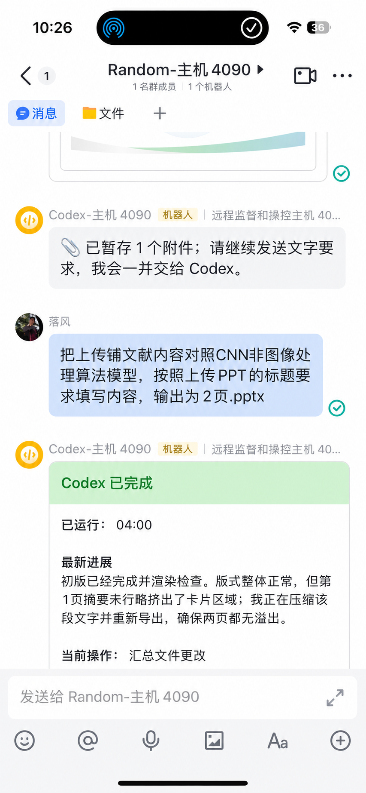

# 飞书桥

### 在飞书里，协调不同设备上的 Codex，并随时检查结果

让 Codex 留在设备上持续工作，你只需要打开飞书。

## 我们的宗旨

越接近通用的 AI，越应该用最自然的方式协作。 
协调 Codex 项目，最符合人类认知规律的方式，就是聊天软件。 
飞书，是其中实际体验最好的国内方案。我们致力于推动它。

## 我们的功能

<strong>01 / 不同设备</strong> 
&emsp;在飞书里协调不同设备上的 Codex

<strong>02 / 状态同步</strong> 
&emsp;飞书任务中的思考状态、进展与计划，可通过飞书卡片及时同步

<strong>03 / 文件流转</strong> 
&emsp;支持上传文件、图片和视频；任务完成后，Codex 会发来必要的图片、文件和视频

<strong>04 / 无需梯子</strong> 
&emsp;没有梯子，也能流畅使用 Codex

> 从本机 Codex 窗口产生的对话，只同步用户提问与完整结束后的最终回复；思考、工具调用和中间进度不会同步。

## 我们的承诺

<strong>01 / 放心使用</strong> 
&emsp;不植入病毒，不加入恶意指令

<strong>02 / 真实稳定</strong> 
&emsp;每人每天 100+ 轮次对话，持续稳定运行

<strong>03 / 无限 DIY</strong> 
&emsp;特别功能都可以交给 Agent 快速实现，DIY 空间没有上限

## 使用方法

**10min · 无门槛**

> **使用 Codex-5.6 或更高水平的 AI Agent 模型，拉取当前项目并遵循指令即可。**

  
  &nbsp;
  

如果它帮到了你，欢迎点亮 ⭐ Star。

